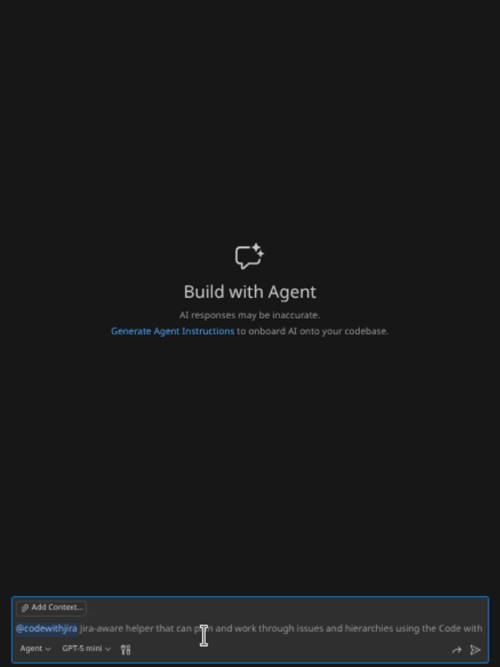
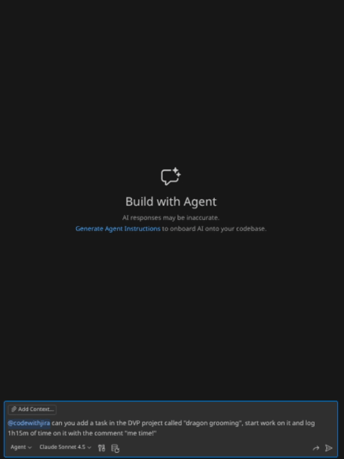

<div align="center">
  
  <h1>Code with Jira</h1>
  <p>
    
    <em>by Brainicorn</em>
  </p>
  <p><strong>The new standard in Jira/IDE integration</strong></p>
</div>

Seamlessly integrate Jira Cloud into VS Code. Manage work items, auto-time tracking, track comment tags, and leverage AI-powered planning—all without leaving your editor.

---


---

## ✨ Key Features

### 🌳 **Work Items & Spaces Tree Views**

Browse your Jira work items and spaces in familiar tree structures.

#### work items

- Create custom JQL queries to organize your work exactly how you like it.
- Drag and Drop to change hierarchy
- Prominent action buttons
- Useful context menu

#### spaces

- Pin favorite spaces for quick access
- Quickly launch common queries in the JQL/List viewer
- See recently viewed spaces


### 📝 **Rich Work Item Editor**

Full-featured webview for viewing and editing Jira work items. Responsive split-pane layout with support for:

- Rich text editing (Atlassian Document Format)
- Attachments, work item links, and remote links
- Sub-tasks and activity streams
- Status transitions with transition screens
- All standard and custom fields


### 🚀 **Start/Stop Work Flow**

One-click workflow to start working on a work item:

- ✅ Automatic branch creation with configurable naming templates
- ✅ Work item status transition (e.g., "To Do" → "In Progress")
- ✅ Automatic assignment to yourself
- ✅ Optional automatic time tracking and work logging
- ✅ Smart branch detection—automatically detects when your branch is merged


### 🏷️ **Comment Tag Management**

Track TODO, FIXME, HACK, and custom tags across your workspace. Create Jira work items directly from tagged comments. View tags grouped by type or by file.


### 🔍 **Advanced JQL Editor**

Full-featured JQL editor with syntax highlighting, auto-completion, and intelligent field suggestions. View results in a configurable data grid.


### ✨ **AI-Powered Features** _(Requires GitHub Copilot)_

- **Natural language planning**: "Create work items for implementing user authentication" → generates Epic → Tasks → Sub-tasks
- **Chat participant** (`@codewithjira`): Start/stop work, navigate hierarchies, get AI task recommendations
- **Full LM tools suite**: Automate workflows without manual interaction


---

## 🚀 Quick Start

### Installation

1. Install from the [VS Code Marketplace](https://marketplace.visualstudio.com/items?itemName=brainicorn.code-with-jira)
2. Open the Command Palette (`Ctrl+Shift+P` / `Cmd+Shift+P`)
3. Run: `Code with Jira: Add Jira Site`
4. Authenticate with your Jira Cloud instance

### Your First Work Item

1. Open the **Jira Work Items** tree view in the Explorer sidebar
2. Expand the default **My Items** query (or any other JQL query) to see work items
3. **Click** a work item to open it in the editor
4. Use the inline buttons on work items to:
    - Start work (creates branch and transitions status)
    - Add child items
    - Access additional actions
5. **Right-click** any node for context menu with more options

---

## 📚 Feature Guide

### Work Items Tree View

Browse and manage your Jira work items:

- **Custom JQL queries**: Create, edit, rename, and delete saved queries
- **Hierarchical view**: See parent-child relationships (Epics → Tasks → Sub-tasks)
- **Quick filters**: View work items by status, assignee, or custom JQL
- **Context actions**: Open, edit, start work, create child work items

**Pro tip**: Use the inline button or Right-click on a site to create a new custom query.

### Spaces Tree View

Navigate your Jira spaces:

- **Pin favorites**: Keep important spaces at the top
- **Board & backlog links**: Automatically detect and open boards in your browser
- **Space actions**: Create work items, refresh, view in Jira

### Start/Stop Work

**Starting work:**

1. Right-click a work item → **Start Work On Item**
2. Extension will:
    - Create/checkout a branch (e.g., `feature/PROJ-123-my-feature`)
    - Transition work item status (if configured)
    - Assign work item to you (if configured)
    - Start time tracking (if enabled)

**Stopping work:**

- Right-click work item → **Stop Work**
- Or: When you delete your branch (after merging a PR), the extension detects it and optionally transitions the work item to "Done"

**Configuration:**

```json
{
    "codeWithJira.startWork.branchNameTemplate": "feature/${issueKey}-${issueSummary}",
    "codeWithJira.startWork.transitionToInProgress": true,
    "codeWithJira.startWork.assignToSelf": true
}
```

### Creating Work Items

**Quick create:**

- Right-click a site or work item → **Create Work Item**
- Simple QuickPick for basic fields
- Auto-escalates to full editor if work item type requires complex fields

**Create from comment tags:**

- Highlight a TODO/FIXME tag
- Click the code insight lightbulb 💡
- Click create work item
- Summary pre-filled from tag content
- Issue key automatically added back to the comment after creation

### Comment Tags

**View modes:**

- **Group by Tag**: See all TODOs together, all FIXMEs together, etc.
- **Group by File**: See all tags per file in folder hierarchy
- **Compact Folders**: Reduce tree depth by combining single-child folders

**Jira integration:**

```typescript
// TODO: Implement feature EV-123
// The extension recognizes the issue key and shows it as linked
```

**Configuration:**

```json
{
    "codeWithJira.commentTags.viewMode": "groupByTag",
    "codeWithJira.commentTags.scanMode": "workspace",
    "codeWithJira.commentTags.createWorkItemTriggers": {
        "TODO": "#FFCC00",
        "FIXME": "#FF0000",
        "NOTE": "#00AAFF"
    },
    "codeWithJira.commentTags.includeGlobs": ["src/**", "lib/**"],
    "codeWithJira.commentTags.excludeGlobs": ["**/node_modules/**", "**/dist/**"]
}
```

### JQL Editor

**Features:**

- Auto-completion for fields, operators, values, functions
- Context-aware suggestions based on cursor position
- Field value lookup from your Jira data
- Error highlighting
- Search button to preview results

**Usage:**

1. Command Palette → `Code with Jira: Open JQL Editor`
2. Write your query with auto-complete assistance
3. Clcik the search icon
4. Results appear in data grid below
5. Click any result to open full work item editor


---

## ✨ AI Features (GitHub Copilot)

### Setup

The extension provides a custom Copilot agent and LM tools for AI-powered workflows.

**Enable/Disable AI Features:**
AI features can be toggled on or off in VS Code settings:

```json
{
    "codeWithJira.ai.enabled": true // Set to false to completely disable AI features
}
```

When disabled, the chat participant and all AI tools are completely removed from the extension.

#### Chat Participant: `@codewithjira`

Ask questions and manage your Jira workflow in natural language:

**Search & Discovery:**

```
@codewithjira what are my open APL issues?
@codewithjira what about APL-35?
```



**Create & Organize:**

```
@codewithjira Create 3 tasks under epic APL-88 for frontend, backend, and testing
```

**Workflow & Time Tracking:**

```
@codewithjira can you add a task in the DVP project called "dragon grooming", start work on it and log 1h15m of time on it with the comment "me time!"
```



**Relationships & Dependencies:**

```
@codewithjira Mark DVP-90 as blocking DVP-91 and add a comment explaining why
```

#### Plan Agent (Custom Agent)

Create complex Jira hierarchies from natural language:

**Setup:**

1. Command Palette → `Code with Jira: Show Plan Agent Config`
2. Copy the configuration shown
3. Command Palette → `Chat: Configure Custom Agents...` → **Create New Agent**
4. Paste configuration and save

**Usage:**

```
@plan create Jira work items for implementing user authentication with OAuth
```

The agent will:

1. Analyze your request
2. Generate an Epic → Tasks → Sub-tasks hierarchy
3. Show you a draft for review
4. Create all work items in Jira upon confirmation

**What the agent can do:**

- Get plan context (sites, spaces, work item types)
- Create work item hierarchies
- Validate against your Jira configuration
- Handle complex nested structures

**Permissions:**

- Uses your existing Jira authentication
- No credentials exposed to Copilot
- All commands are non-interactive when called as tools

---

## ⚙️ Configuration

### Accessing Settings

1. Open VS Code Settings: `Ctrl+,` (Windows/Linux) or `Cmd+,` (Mac)
2. Search for "Code with Jira" or click **Extensions** → **Code with Jira**

### Configuration Sections

#### 🌳 Work Item Tree

- **JQL Queries**: Manage your saved queries that appear in the tree
- **Fetch All Results**: Toggle pagination for large query results
- **Results Per Page**: Control how many items load at once

#### 🏷️ Comment Tags

- **Enable/Disable**: Turn comment tag scanning on or off
- **Tag Colors**: Customize colors for TODO, FIXME, HACK, NOTE, etc.
- **View Mode**: Choose between grouping by tag type or by file
- **Include/Exclude Patterns**: Control which files are scanned using glob patterns
- **Scan Mode**: Workspace-wide, open files only, or both

#### 📝 Create Work Item

- **Input Method**: Choose Quick Pick (fast) or Editor (full-featured) as default
- Configure separately for command palette, space tree, and child items

#### 🚀 Start Work

- **Branch Name Template**: Customize how branch names are generated
    - Use variables like `${issueKey}`, `${issueSummary}`, `${issueType}`
- **Branch Prefixes**: Define prefixes based on work item types
- **Turbo Mode**: Skip confirmation screens for faster workflow
- **Branch From**: Choose to branch from default or current branch
- **Auto-Transition**: Automatically move items to "In Progress" status
- **Transition Parents**: Also transition parent items in hierarchy
- **Time Tracking**: Enable automatic time tracking

#### ⏹️ Stop Work

- **Auto-Stop on Branch Delete**: Configure behavior when branch is deleted
- **Transition on Stop**: Move items to "Done" when stopping work
- **Bypass Temporary Switch**: Skip prompts when temporarily switching branches

#### ✨ AI Features

- **Enable/Disable**: Turn AI features on or off completely
- Controls both the chat participant (`@codewithjira`) and planning agent

**Tip**: Most settings include detailed descriptions in the settings UI. Hover over any setting for more information!

---

## 🌐 Multi-Site Support

Connect to multiple Jira Cloud instances:

1. Command Palette → `Code with Jira: Add Jira Site`
2. Authenticate with each site
3. Sites are workspace-specific
4. Switch sites using tree view toolbar buttons

---

## 🎯 Use Cases

### For Individual Developers

- ✅ Stay in your editor while managing Jira work items
- ✅ Consistent branch naming with templates
- ✅ Track technical debt via comment tags
- ✅ Use AI to break down features into tasks

### For Teams

- ✅ Enforce consistent branch naming across the team
- ✅ Standard workflow transitions
- ✅ Comment tags visible to all team members
- ✅ Shared AI planning for sprint planning

### For Development Leads

- ✅ Quick work item creation from code review findings
- ✅ Bulk-create tasks from planning sessions
- ✅ Monitor progress without leaving VS Code
- ✅ Track team's technical debt through tags

---

## 🤝 Contributing & Support

### Get Help

- 💬 [Slack Community](https://www.brainicorn.com/slack) - Real-time chat and quick help
- 📖 [GitHub Discussions](https://github.com/brainicorn/code-with-jira/discussions) - Ask questions and share tips
- 🐛 [GitHub Issues](https://github.com/brainicorn/code-with-jira/issues) - Report bugs and request features
- 📧 [Support Page](https://www.brainicorn.com/support) - All support channels in one place

### Reporting Issues

Found a bug? Have a feature request?

1. Open the **Help & Feedback** tree view
2. Click **Report a Bug** or **Request a Feature**
3. Or visit: [GitHub Issues](https://github.com/brainicorn/code-with-jira/issues)

### Documentation

- [Configuration Guide](docs/configuration.md) _(coming soon)_
- [Troubleshooting](docs/troubleshooting.md) _(coming soon)_
- [Video Tutorials](docs/videos.md) _(coming soon)_

---

## 📜 License

See [LICENSE.txt](LICENSE.txt) for details.

---

## 🙏 Acknowledgments

Built with:

- [Atlassian REST API v3](https://developer.atlassian.com/cloud/jira/platform/rest/v3/)
- [VS Code Extension API](https://code.visualstudio.com/api)
- [GitHub Copilot](https://github.com/features/copilot)

---

**Code with Jira** - The new standard in Jira/IDE integration.

[Install Now](https://marketplace.visualstudio.com/items?itemName=brainicorn.code-with-jira) | [Slack Community](https://www.brainicorn.com/slack) | [Support](https://www.brainicorn.com/support) | [Report Issue](https://github.com/brainicorn/code-with-jira/issues)
